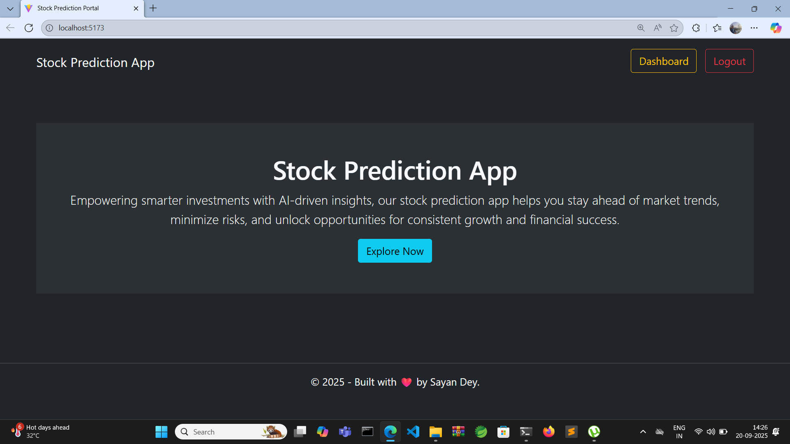

# stock-prediction-app
A Stock Prediction Application, built using React JS and Django. Features of the project
1. User Registration.
2. User Login.
3. Dashboard.
4. Graphical representation of stock prices.
5. 
 ## Machine Learning Model
 For the Machine Learning part, LSTM model has been used alongside React in the frontend and Django (with Django Rest Framework) in the backend.

 ## Project Images
 **Home Page**
 

 **Registration Page**
  

  **Log in page**
   

   **Dashboard**
    

  **Output 1**
   

   **Output 2**
    

   **Output 3**
   
